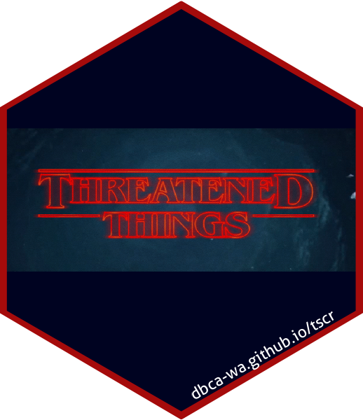

<!-- README.md is generated from README.Rmd. Please edit that file -->

```{r, include = FALSE}
knitr::opts_chunk$set(
  collapse = TRUE,
  comment = "#>",
  fig.path = "man/figures/README-",
  out.width = "100%"
)
```

# `tscr`: An R client for the Threatened Species and Communities DB (TSC)  

<!-- badges: start -->

[](https://codecov.io/gh/dbca-wa/tscr?branch=master)
[](https://github.com/dbca-wa/tscr/commits/master)
[](https://github.com/dbca-wa/tscr/issues)
<!-- badges: end -->

The goal of tscr is to provide access to TSC data, and to provide working 
examples of analysis and visualisation of TSC data to answer QA, ecological, and
management questions.

## Installation

You can install tscr from [GitHub](https://github.com/dbca-wa/tscr/) with:

``` r
# install.packages("devtools")
remotes::install_github("dbca-wa/tscr")
```

Read `vignette("setup", package = "tscr")` to learn how to configure tscr to use 
TSC's API.

## Working examples
Here we'll list vignettes demonstrating working examples of answering questions
with TSC data.

## Contribute
Learn how to contribute by reading the Contributing guidelines.
