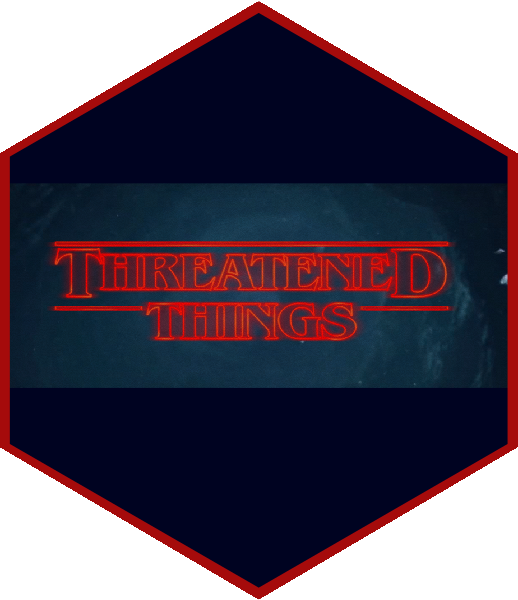

<!-- README.md is generated from README.Rmd. Please edit that file -->

# `tscr`: An R client for the Threatened Species and Communities DB (TSC) 

<!-- badges: start -->

[](https://github.com/dbca-wa/tscr/actions)
[](https://codecov.io/gh/dbca-wa/tscr?branch=master)
[](https://github.com/dbca-wa/tscr/commits/master)
[](https://github.com/dbca-wa/tscr/issues)
<!-- badges: end -->

The goal of `tscr` is to provide read/write access to TSC data, and to
provide working examples of analysis and visualisation of TSC data to
answer QA, ecological, and management questions as well as working data
ETL pipelines.

## For conservation managers and ecologists

Here we’ll list working examples of conservation management nature,
ecological, or data QA questions answered with TSC data.

Example questions (to be replaced with working examples):

-   How many birds rose in conservation listing status in WA in the past
    X years?
-   Which conservation significant plants have been recorded in DBCA
    District X?
-   What is the predicted habitat for a taxon known under taxonomic name
    X?
-   Generate a formatted PDF and a plain CSV spreadsheet of threatened
    flora and fauna names in WA.
-   Generate an interactive map of all accepted occurrences in area X.
-   List conservation documents coming up for review within the next 6
    months.
-   List occurrences flagged for review.

Help us completing this list by filing new “Data export or analysis
requests” [here](https://github.com/dbca-wa/tscr/issues/new/choose).

## For data engineers

If you wish to run any of the included working examples or create new
data analyses, install this package and configure `tscr` to TSC’s API
with your own credentials as outlined below.

Use cases:

-   Update TSC taxonomy from WACensus:
    [`vignette("wacensus", package="tscr")`](https://dbca-wa.github.io/tscr/articles/wacensus.html))
-   Create a bulk data export into spreadsheet or GIS formats.
-   Build your own analyses and reports to answer conservation
    management, ecological, or QA questions.
-   ETL of bulk data from third parties (data returns from consultants)
    into TSC.

Install `tscr`:

``` r
# install.packages("devtools")
remotes::install_github("dbca-wa/tscr", 
                        dependencies = TRUE, 
                        upgrade = "ask",
                        build_vignettes = TRUE)
```

Set up `tscr`, run `usethis::edit_r_environ()`, add your TSC API Token,
then restart your R session.

``` r
TSC_API_TOKEN="Token xxx"
```

Read
[`vignette("setup", package="tscr")`](https://dbca-wa.github.io/tscr/articles/setup.html))
to learn more about the configuration of `tscr`.

Working examples for data access and analyses are available as package
vignettes (`browseVignettes("tscr")`), and as articles
[here](https://dbca-wa.github.io/tscr/index.html).

## For contributors

Found a bug in `tscr`, need a new `tscr` feature, or need a working
example to generate a data product from TSC? Let us know
[here](https://github.com/dbca-wa/tscr/issues/new/choose)!

Want to chat about TSC? Join the [“TSC” group on DBCA’s
Teams](https://teams.microsoft.com/l/channel/19%3a20412eea61c949e59460ece939a128cd%40thread.tacv2/General?groupId=920e28d1-f344-429d-a2cb-613103a99b9e&tenantId=7b934664-cdcf-4e28-a3ee-1a5bcca0a1b6)!
(You’ll need a DBCA account to access this group.)

Want to contribute code? Start with the [contribution
guide](https://dbca-wa.github.io/tscr/CONTRIBUTING.html), but don’t be
afraid to ask for help and submit early PRs.

## For package maintainers and contributors

Tasks that can be run for each release are shown below.

``` r
usethis::use_version(which = "dev") # patch, dev, minor, major

# Rebuild included package data, used for tests and vignettes
source(here::here("data-raw/make_data.R"))

# Tests shall pass
devtools::test()

styler::style_pkg()
lintr:::addin_lint_package() # some lint errors are OK
devtools::document(roclets = c("rd", "collate", "namespace", "vignette"))
spelling::spell_check_package()
spelling::spell_check_files("README.Rmd", lang = "en_AU")
spelling::update_wordlist()
codemetar::write_codemeta()
if (fs::file_info("README.md")$modification_time <
  fs::file_info("README.Rmd")$modification_time) {
  rmarkdown::render("README.Rmd", encoding = "UTF-8", clean = TRUE)
  if (fs::file_exists("README.html")) fs::file_delete("README.html")
}
#
# Checks
goodpractice::goodpractice(quiet = FALSE)
devtools::check(cran = FALSE, remote = TRUE, incoming = TRUE)
#
# Add new feature to news if user-facing
usethis::edit_file("NEWS.md")

# Commit and push
```
